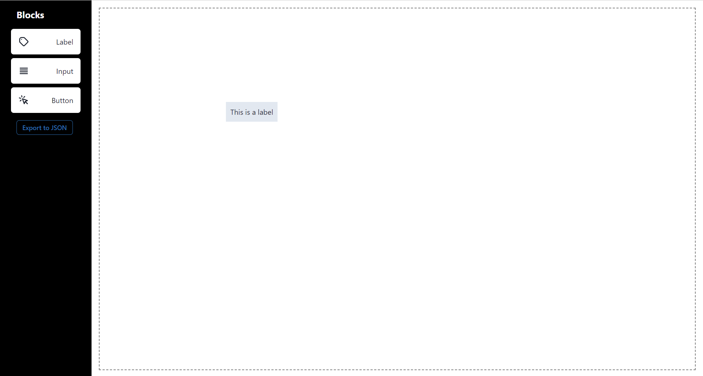
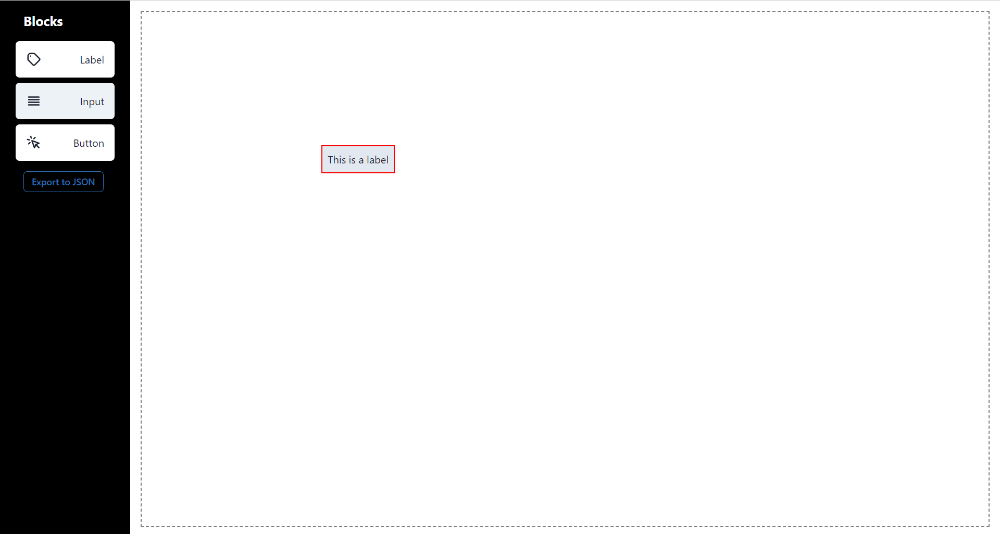

# Mini Page Builder

## Description
Mini Page Builder is a web application that allows users to build custom pages by dragging and dropping components from a sidebar onto a blank canvas. Users can configure each component and arrange them on the canvas to design their desired layout.

[Click here to visit site]()

## Installation
1. Clone the repository.
2. Navigate to the project directory.
3. Run `npm install` to install dependencies.
4. Run `npm start` to start the development server.
5. Open in live server to view the application.

## Screenshots

#### Home

#### Label Modal

#### Input Modal

#### Button Modal

#### Element

#### Selected Element

## Features
- Drag and drop components (Label, Input, Button) from the sidebar onto the canvas.
- Configure each component's position and properties via a modal.
- Each component is draggable, can be dragged anywhere inside he canvas.
- Delete components by selecting them and pressing delete.
- Automatic saving of changes to local storage.
- Export page configuration to a JSON file .

## Technologies Used
- React JS
- Chakra UI 
- Local Storage API

## Usage
1. Drag components from the sidebar onto the canvas.
2. Configure component properties in the modal.
3. Click save changes to apply configurations.
4. Drag components on the canvas to rearrange them.
5. Select components and press delete to delete them.

## Export Functionality
Users can export the current page configuration to a JSON file by clicking the "Export to JSON" button in the sidebar.

